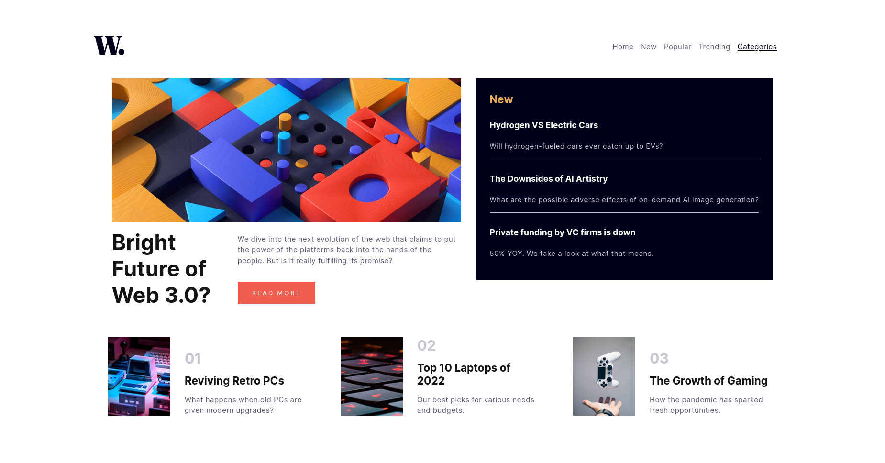
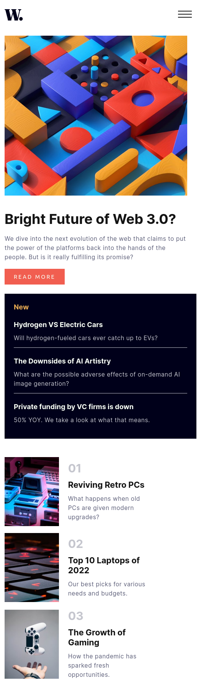
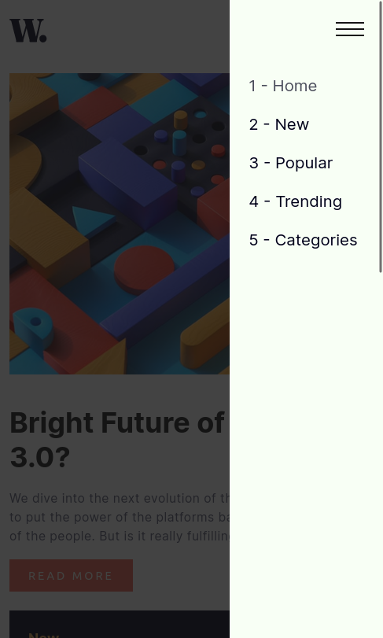

# Frontend Mentor - News homepage solution

This is a solution to the [News homepage challenge on Frontend Mentor](https://www.frontendmentor.io/challenges/news-homepage-H6SWTa1MFl). Frontend Mentor challenges help you improve your coding skills by building realistic projects.

## Table of contents

- [Overview](#overview)
  - [The challenge](#the-challenge)
  - [Screenshot](#screenshot)
  - [Links](#links)
- [My process](#my-process)
  - [Built with](#built-with)
  - [What I learned](#what-i-learned)
  - [Continued development](#continued-development)
  - [Useful resources](#useful-resources)
- [Author](#author)
- [Acknowledgments](#acknowledgments)

**Note: Delete this note and update the table of contents based on what sections you keep.**

## Overview

### The challenge

Users should be able to:

- View the optimal layout for the interface depending on their device's screen size
- See hover and focus states for all interactive elements on the page

### Screenshots





### Links

- Solution URL: [Add solution URL here](https://your-solution-url.com)
- Live Site URL: [Add live site URL here](https://your-live-site-url.com)

## My process

### Built with

- Semantic HTML5 markup
- Sass variables and mixins
- Flexbox
- Desktop-first workflow
- [Scss](https://sass-lang.com/) - For styles

### What I learned

This is my first site that focuses on the mobile design by using media queries and mixins I applied the responsive design to this site.

Below shows the mixins I used for applying the media queries. I learned this from Jonas Schmedtmann Advanced CSS course.

```scss
@mixin respond($breakpoint) {
  @if $breakpoint == phone {
    @media only screen and (max-width: 37.5em) {
      @content;
    } //600px
  }

  @if $breakpoint == tab-port {
    @media only screen and (max-width: 56.25em) {
      @content;
    } //900px
  }

  @if $breakpoint == tab-land {
    @media only screen and (max-width: 75em) {
      @content;
    }
  }
}
```

### Continued development

There is a small problem with the app. For tab-port(tablet portrait) navigation items disappear and an icon appears that allows you to check navigation items via a popup. When this popup stays open and then the screen gets bigger. The icon disappear and there is no way to close the popup so, I want to work on that.

### Useful resources

I mainly used flexbox to order the elements in the website below are very useful resources if you want to learn more about flexbox.

- [A Guide to Flexbox](https://css-tricks.com/snippets/css/a-guide-to-flexbox/) - When it comes to learning and remembering flex properties you might forget them. To counter this I used this site.
- [Flexbox Playground](https://codepen.io/enxaneta/full/adLPwv/) - To quickly play around flex properties.

## Author

- Website - [Yusuf Akyurek](https://www.your-site.com)
- Frontend Mentor - [@yumelih](https://www.frontendmentor.io/profile/yourusername)

## Acknowledgments

I used Jonas Schemedtmann course solution for applying media queries and animation used in the course change icon appereance when hovered.
